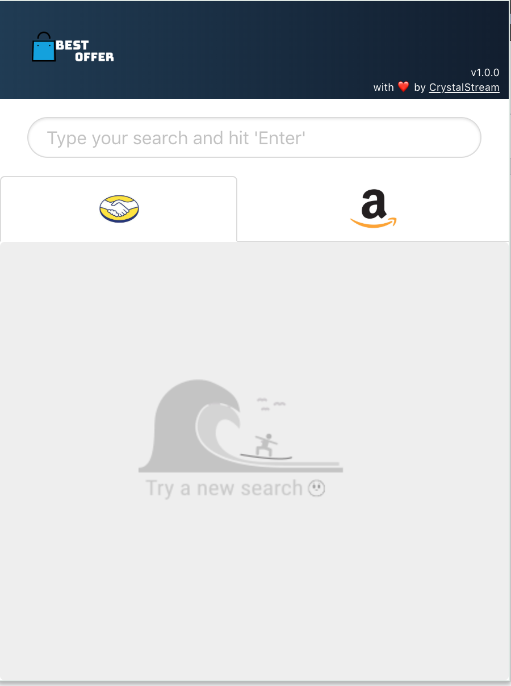
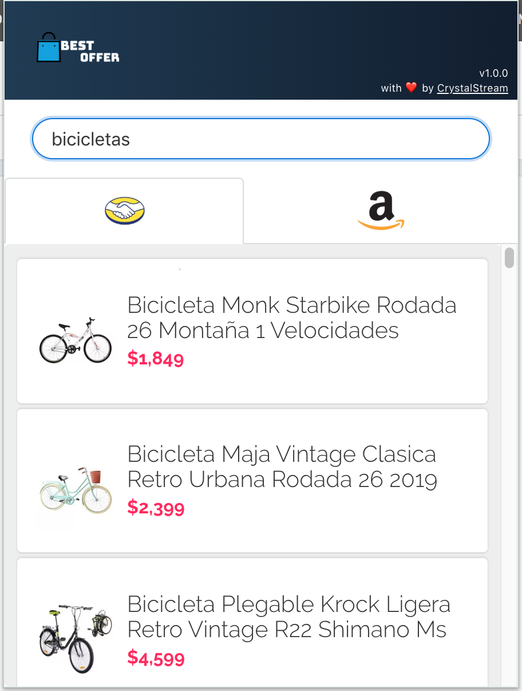

# Mercado-Amazon Extension - Scrapper




This repo holds the scrapper and the extension that acts like a client for a flask app.

```
- mercado-amazon <--- Chrome Extension (built with React)
- scraper <--- Flask app that do all the scrapping
```

# Setup

## Scrapper

It's a simple flask app that holds only one endpoint and do all the scrapping.

You'll to install some python libs, and I highly recommend you to use [virtual envs]().

First move to the `scraper/` folder, once you're there, you can install the dependencies by running:

```bash
pip install -r requirements.txt
```

then to run it:

```bash
export FLASK_ENV=development
flask run
```

and you'll have a web server on your `localhost:5000`, any route other than `/api/search` will return:

```js
{
  "results": "not found",
  "status_code": 404
}
```

To run the test:

```bash
python tests/test_api.py
```


## Mercado-Amazon

It's a chrome extension created with [CRA]().

The setup it's really simple, just place yourself on `mercado-amazon/` folder, then install all the dependencies:

```bash
yarn install
```

then you can running on your localhost with:

```bash
npm start
```

Or you can **build** the app and dropp the `build/` folder in `chrome://extensions` and you can start using it

> For local development you'll need to have both apps running.
